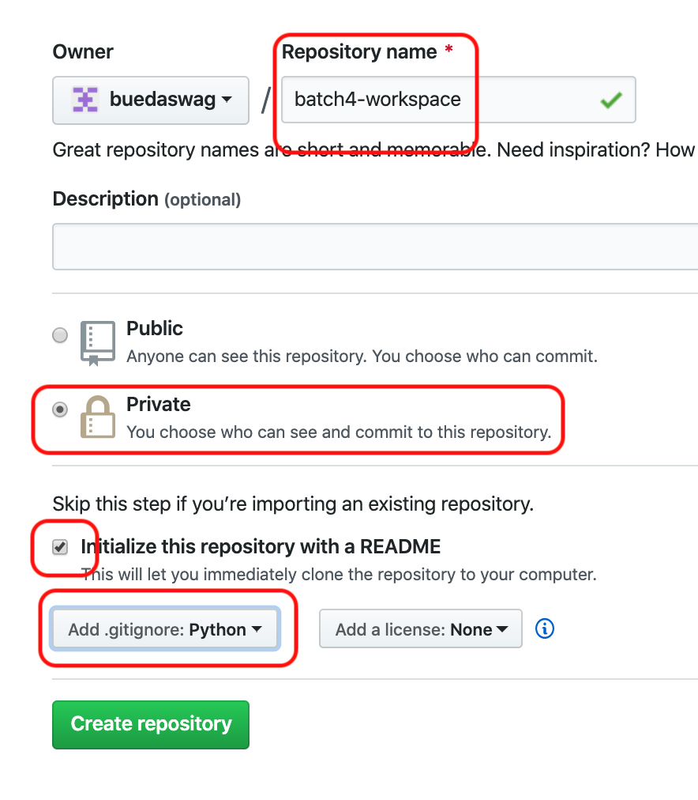
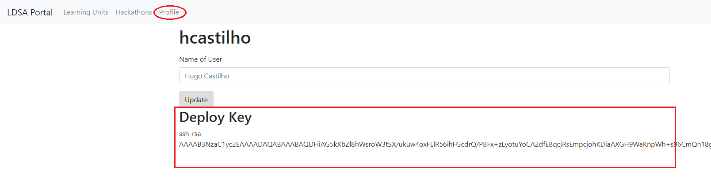
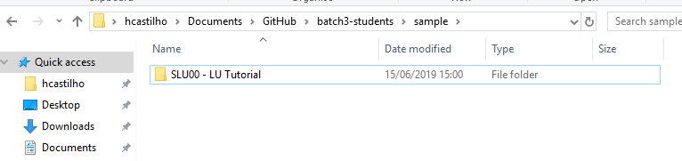
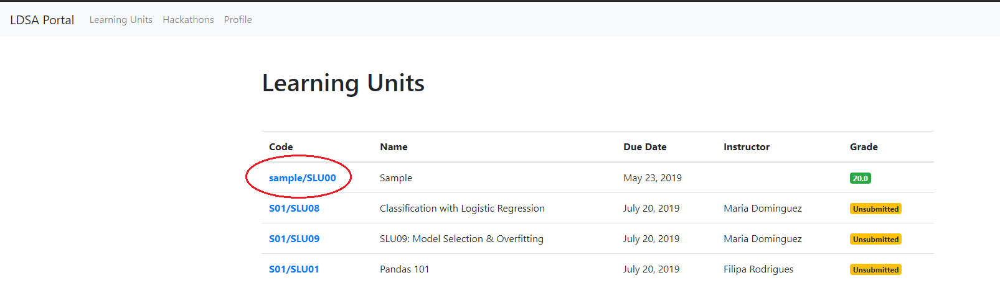
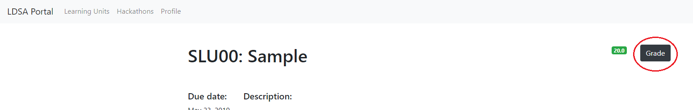
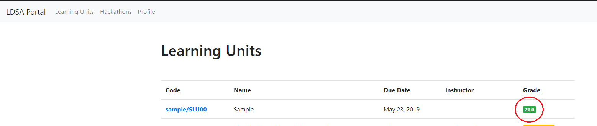

# Batch 4 Students Repository

Welcome to Lisbon Data Science Academy Batch 4 Students repository. The presentation used at the introduction of
the bootcamp is TODO CHECK THIS LINK [here](https://docs.google.com/presentation/d/1uMTbu7vRd0tYEp2ksOqRZyLefPEBB_0-pvanLtAOhjk/edit?usp=sharing).

Here is you'll find all information needed to setup your environment and the
workflow you'll use during the academy.

1. [Initial Setup](#initial-setup)
    1. [Windows Setup](#Windows-Setup)
    1. [MacOS Setup](#MacOS-Setup)
    1. [Setup _Git_/_GitHub_](#setup-_git__github_)
    1. [Install _Anaconda_](#install-_anaconda_)
    1. [Setup your Workspace Repository](#setup-your-workspace-repository)
    1. [Get the Learning Material](#get-the-learning-material)
    1. [Running and Submitting a Learning Unit](#running-and-submitting-a-learning-unit)
1. [Learning Unit Workflow](#learning-unit-workflow)
1. [Updates to Learning Units](#updates-to-learning-units)
1. [Help](#help)
    1. [Learning Unit](#learning-unit-workflow)
    1. [_Portal_](#_portal_)
    1. [Other](#other)

TODO: There is also a screencast to accompany this readme.


## Initial Setup

**IMPORTANT**
Before the bootcamp you will have to complete these instructions, this is
essential.

Once you complete the setup mark yourself as such on [this spreadsheet](https://docs.google.com/spreadsheets/d/1bEOwvEmEJONYzW94efixHa8Te8I_QKC91m8WPoADxjY/edit?usp=sharing).

By completing this you will setup and learn about all the tools you'll be
using during the academy.
We will also be able to identify any problems in time to figure out a solution.


### Windows Setup

This section deals with setting up either Windows Subsystem for Linux (WSL)
or VMWare.
If you are using MacOS or Linux you can skip this section.

If you are using windows 10 we suggest using WSL (see below), if you are using an older Windows version we also support running a virtual linux machine with VMWare (TODO note that for this you will need at least 8 GB of RAM).

##### Why do I need to install either WSL or VMware?

Because of the differences in command line syntax between Windows vs Mac OS/Linux, it would be a great challenge for us to support and provide instructions for both Operating Systems. For this reason, we’d ask you to install Windows Subsystem for Linux, or VMware, which would enable you to run Linux command lines inside Windows. Keep in mind that these are simply extensions to your Windows operating system, hence, installing this software will not do any changes on your laptop. It is also quick to do so.

TODO If due to some reasons, you cannot install WSL or VMware (e.g. you do not have the admin rights for your computer), you can still join the Prep Course and follow the Learning materials. However, all of our setup instructions and learning materials are created for Mac OS/Linux, and unfortunately we will not be able to provide support on how to do it on Windows.
If you have some doubts/worries, feel free to reach out to us.

#### Windows 10 Setup

Follow [this guide](guides/Windows_Subsystem_for_Linux_Installation_Guide_for_Windows_10.md) if you are running Windows 10.

#### Older Windows Setup

If you are running an older version of Windows (such as Windows 8 or 7), follow the guide below on running Ubuntu with Windows using VMware Player. You'll be required to download VMware and Ubuntu 18, for that please use the links provided below (not the links provided in the tutorial).
* [VMware download link](https://www.vmware.com/go/getplayer-win)
* [Ubuntu download link](https://ubuntu.com/download/desktop/thank-you?version=18.04.4&architecture=amd64)
* Follow this guide: [How To Run Ubuntu in Windows 7 with VMware Player](https://www.howtogeek.com/howto/11287/how-to-run-ubuntu-in-windows-7-with-vmware-player/)

### MacOS Setup

Some of the steps in the following sections will require _Homebrew_ for MacOS.
Homebrew will make it easier to install software that we will use later on.
To open the terminal, choose one:
* In Finder , open the /Applications/Utilities folder, then double-click Terminal.
* By pressing <kbd>cmd</kbd> + <kbd>space</kbd> then type `terminal` and press <kbd>enter</kbd>.

The terminal should now be open:


Copy and paste the following line in the terminal:
```bash
/bin/bash -c "$(curl -fsSL https://raw.githubusercontent.com/Homebrew/install/master/install.sh)"
```
You may be offered to install the _Command Line Developer Tools_, confirm and
once it's finished continue installing Homebrew by pressing <kbd>enter</kbd> again.


### Setup _Git_/_GitHub_

Having a _GitHub_ account and knowing the basics of committing and pushing
changes are mandatory.
By the end of this setup you will have accomplished both.
Complete the following steps:

1. [Sign up](https://github.com/join) for a _GitHub_ account if you don't
already have one.
1. [Checking for existing SSH keys](https://help.github.com/en/github/authenticating-to-github/checking-for-existing-ssh-keys)
1. [Generating a new SSH key and adding it to the ssh-agent](https://help.github.com/en/github/authenticating-to-github/generating-a-new-ssh-key-and-adding-it-to-the-ssh-agent)
1. [Adding a new SSH key to your GitHub account](https://help.github.com/en/github/authenticating-to-github/adding-a-new-ssh-key-to-your-github-account)
1. [Testing your SSH connection](https://help.github.com/en/github/authenticating-to-github/testing-your-ssh-connection)


### Setup your Workspace Repository

It's good practice to store your work with version control.
In this academy that is a requirement as it is how you will make your work
available to us.

#### Creating the Workspace

1. Log into _GitHub_
1. Create a new **private** _GitHub_ repository called *batch4-workspace*, see
[Creating a new repository](https://help.github.com/en/articles/creating-a-new-repository).
**IMPORTANT** The repo **MUST** be named *batch4-workspace*!
If you name it anything else, you will be unable to submit any of your work!
    1. You need to explicitly select Private - This is your work and nobody else's.
    You will be graded based upon the merits of what you are able to do here
    so this should not be open to the world while you are working
    on it.
    Maybe after the course is completed, you can open-source it but not this
    time.
    1. Initialize with a README.
    This is mostly just so that you don't initialize an empty repo.
    1. Add a Python `.gitignore`.
    This step is insanely important. If you don't do this, you may
    end up checking things into the repo that make it un-gradeable by our
    grading system.
    ADD THE `.gitignore` PLEASE!!!! <--- 4 * `!` isn't enough



#### Add a Deploy Key to your Repository

Since the repository is private you will have to explicitly give access so
that our grading system can fetch the repository.
To do this you will be adding a deploy key to the repository, which we
provide to you in our [_Portal_](https://portal.lisbondatascience.org/).

1. Head on to the [_Portal_](https://portal.lisbondatascience.org/)
1. Log in with your _GitHub_ account
1. Go to your [profile](https://portal.lisbondatascience.org/users/info/) and
copy the deploy key

1. Go back to the repository you have just created
1. Go back to the repository you have just created
1. Go to `Settings > Deploy Keys`
1. Click "Add deploy key"
1. Give it a recognizable name like "grader" and paste the key from the
_Portal_


#### Cloning the Workspace

1. Open a Terminal or Git Bash, the next steps are on this terminal
1. Clone your _<username>/batch4-workspace_ repository
```bash
git clone git@github.com:<username>/batch4-workspace.git
```

### Get the Learning Material

You will be cloning the [batch4-students](https://github.com/LDSSA/batch4-students)
repository.
All of the learning material you need will be made available on this repo
as the academy progresses.

1. Open a Terminal or Git Bash, the next steps are on this terminal
1. Clone the students repository
[batch4-students](https://github.com/LDSSA/batch4-students)
```bash
git clone https://github.com/LDSSA/batch4-students.git
```
Or if you have your ssh keys set up:

```bash
git clone git@github.com:LDSSA/batch4-students.git
```

### Running and Submitting a Learning Unit

In the `batch4-students` repository that you just cloned there is a sample
learning unit.
It's used to give instructors guidelines to produce the learning units.
We are also using it to ensure that you are able to run and submit a learning
unit.

So go ahead and copy the sample directory `sample/SLU00 - LU Tutorial` from the `
batch4-students` repository to your repository (named `batch4-workspace`).


The grader only requires you to have the contents in a directory starting with
the learning unit's ID, but we highly advise to keep the same directory
structure as the students repository.
All learning units are organized as:
```
<specialization ID> - <specialization name>/<learning unit ID> - <learnin unit name>
```
Doing so will help you keep organized and ease copying data from the students
repository to yours.

#### Creating a Python Virtual Environment and installing the necessary packages

Bellow are the instructions that are enough to get the setup done and get you up and running :)
You can also follow [this guide](guides/How_to_set_up_python_virtual_environments.md) for a more in depth set of instructions that accomplish exactly the same thing.

You should always be using a virtual environment to install python packages. We'll use _venv_ to set them up.

To install and update packages, we'll be using _pip_ which is the reference Python package manager.

If you are using **Ubuntu** you will need to install a couple of packages first,
this can be done in a terminal by running:
```bash
sudo apt update && sudo apt upgrade && sudo apt install python3-pip python3-venv
```

If you are using **Mac OS** you will need to install python, this can be done in a terminal by running:
```bash
brew install python
```

##### Start by installing ensuring pip, setuptools, and wheel are up to date:

```bash
python3 -m pip install --user --upgrade pip setuptools wheel
```

* Create a virtual environment with the name `prep-venv`
```bash
python3 -m venv ~/.virtualenvs/prep-venv
```
* Activate the environment

```bash
source ~/.virtualenvs/prep-venv/bin/activate
```

>Note: after you activate your virtual environment you should see at the leftmost of your command line the name of your virtual environment surrounded by parenthesis, like this:

```bash
mig@macbook-pro % source ~/.virtualenvs/prep-venv/bin/activate
(prep-venv) mig@macbook-pro %
```
And you're able to make sure your virtual environment is active using the `which` command:

```bash
(prep-venv) mig@macbook-pro % which python
/Users/mig/.virtualenvs/prep-venv/bin/python
```

Please don't forget to update pip.
```bash
pip install -U pip
```

This means that our virtual environment is active.

*IMPORTANT!!!* make sure that your virtual environment is active before you proceed

* Now you're ready to install packages! Just enter the directory of the `SLU000 - Jupyter Notebook` using the `cd` command, and install the required packages that are enumerated in the `requirements.txt` file

```bash
cd ~/projects/ds-prep-workspace/"Week 0"/"SLU000 - Jupyter Notebook"
pip install -r requirements.txt
```

#### Working on the Learning Unit

All learning units come as a set of Jupyter Notebooks (and some links to
presentations).
Notebooks are documents that can contain text, images and live code that you
can run interactively.

In this section we will launch the Jupyter Notebook application.
The application is accessed through the web browser.

Once you have the application open feel free to explore the sample learning
unit structure.
It will give you a handle on what to expect and what rules the instructors
follow (and the effort they put) when creating a learning unit.

So let's start the Jupyter Notebook app:
1. Activate your virtual environment
    ```bash
    source ~/.virtualenvs/prep-venv/bin/activate
    ```
1. Enter the Learning unit directory in your workspace directory (`ds-prep-workspace`).
    >Note: It is **VERY IMPORTANT** that you **ALWAYS** work on the files on your `ds-prep-workspace` repository, and **NEVER** work on files that are in your `ds-prep-course` repository!
    ```bash
    cd ~/projects/ds-prep-workspace/"Week 0"/"SLU000 - Jupyter Notebook"
    ```
1. Run the jupyter notebook
    >**Windows 10 note:** if you are running **Windows 10** with WSL, the command to run the jupyter notebook is: `jupyter notebook --NotebookApp.use_redirect_file=False`
    ```bash
    jupyter notebook
    ```

When you run the `jupyter notebook` command, you should see something similar to this in your terminal:

Your browser should pop up with Jupyter open, however, if this does not happen, you can simply copy the link you see on your terminal (the one that contains `localhost`) and past it in your browser's address bar:


>Note: If you see these scarry looking error messages, don't worry, you can just ignore them.


##### The Exercise Notebook

Make sure you open and go through the Learning Notebook first.

Every learning unit contains an exercise notebook with exercises you will
work on.
So let's have a look at the sample Learning Unit.
1. On the Jupyter Notebook UI in the browser open the exercise notebook

1. Follow the instructions provided in the notebook

Besides the exercises and the cells for you to write solutions you will see
other cells with a series of `assert` statements.
This is how we (and you) will determine if a solution is correct.
If all `assert` statements pass, meaning you dont get an `AssertionError` or
any other kind of exception, the solution is correct.

Once you've solved all of the notebook we recommend the following this simple
checklist to avoid unexpected surprises.
1. Save the notebook (again)
1. Run "Restart & Run All"

1. At this point the notebook should have run without any failing assertions

If you want to submit your notebook before it is all the way done to
check intermediate progress, feel free to.

If you are able to go through the entire process and get a passing grade on
the sample LU you'll have a good understanding of the same flow that you'll use
for all LUs throughout the academy.

#### Commit and Push

Now you have worked on the sample learning unit and you have some uncommitted
changes.
It's time to commit the changes, which just means adding them to your `batch4-workspace`
repository history, and pushing this history to you remote on _GitHub_.

* Using the terminal commit and push the changes
```bash
git add .
git commit -m 'Testing the sample notebook'
git push
```

##### Some Advice

Our advice it to get comfortable with _git_, commit often and create branches
to try different solutions and once you're ready merge everything back to
the `master` branch.
Having all of the iterations will help you keep track of your work.

Here is a recommendation for a _git_ workflow, if you are not comfortable you
don't need to use it (but using it _will_ make you comfortable).
1. Create a branch for the learning unit you're working on e.g. `slu00`
1. Copy the files and commit
1. Work a bit and commit, start the commit message with WIP (work in progress)
1. Once you are ready checkout the `master` branch and merge the `slu00` branch
into it
1. Push the changes

#### Grading

1. Go to the [_Portal_](https://portal.lisbondatascience.org) and select the learning unit

1. Select "Grade"

1. After grading is complete you should have 20/20
1. If everything passes locally but the grader doesn't give you the excepted
output head to out [troubleshooting](#_portal_)
1. Once you have your grade don't forget to do the
[spreadsheet](https://docs.google.com/spreadsheets/d/1bEOwvEmEJONYzW94efixHa8Te8I_QKC91m8WPoADxjY/edit?usp=sharing) thing.

## Learning Unit Workflow

Learning units will be announced in the academy's _#annoucements_ channel.
At this point they are available in the
[batch4-students](https://github.com/LDSSA/batch4-students)
repository and submissions are open in the
[_Portal_](https://portal.lisbondatascience.org).

The steps you followed during the initial setup are exactly what you are going
to be doing for each new learning unit.
Here's a quick recap:
1. Once a new learning unit is available pull the changes from the
[batch4-students](https://github.com/LDSSA/batch4-students) repo.
1. Copy the unit to your `batch4-workspace` repo
1. Work
1. Once all tests pass or once you're happy, commit the changes and push
1. Go to the [_Portal_](https://portal.lisbondatascience.org), select the learning unit you're working on and click  "Grade"
1. Refresh the page until you get the results back
1. Profit

## Updates to Learning Units

As much as we try and have processes in place to prevent errors and bugs in
the learning units some make it through to you.
If the problem is not in the exercise notebook you can just pull the new
version from the students repo and replace the file.
The problem is if the correction is in the exercise notebook, you can't just
replace the file your work is there and you'll lose it!

When a new version of the exercise notebook is released (and announced) two
things will happen.
If you submit an old version of the notebook it will be flagged as out of date
and not graded.
You will have to merge the work you've already done into the new version of the
notebook.

At the moment our suggestion to merge the changes is:
1. Rename the old version
1. Copy the new exercise notebook over
1. Open both and copy paste your solutions to the new notebook

We understand it's not ideal and are working on improving this workflow using
[_nbdime_](https://nbdime.readthedocs.io/).
If you are comfortable installing _Python_ packages you can try it out, but
we offer no support for this at the moment.

## Help

TODO should we include the troubleshooting section from the ds-prep-course readme?

During the academy you will surely run into problems and have doubts about the
material.
We provide you with some different channels to ask for help.

### Learning Unit

If you feel something is not clear enough or there is a bug in the learning
material please follow [these steps](https://github.com/LDSSA/wiki/wiki/How-to-ask-for-and-give-help). Remember, there is no such thing as a dumb question, and by asking questions publicly you will help others!

If you have more conceptual questions about the materials or how to approach a problem you can also
reach out to the instructors on slack.
You can find the main contact for the learning unit in the
[_Portal_](https://portal.lisbondatascience.org/) this instructor can help you
out or redirect you to someone that is available at the moment.

### _Portal_

Are you getting different results locally than what you are getting in the
_Portal_?
If so we will first ask to do a bit of troubleshooting.
1. Ensure that you have saved the changes in the notebook
1. Ensure that you have committed and pushed the changes
1. Ensure that you are not using packages that are not present in the original
`requirements.txt` file (changes to this file or your local environment have no
effect)
1. In the learning unit page in the [_Portal_](https://portal.lisbondatascience.org/)
you are able to download the exercise notebook with the results of the grader
by clicking your grade, have a look to figure out what went wrong.

If none of these steps helped go ahead and open a support ticket for the portal
[here](https://github.com/LDSSA/batch4-portal-support).

Is the _Portal_ down or acting out in some unexpected way?
Then please open a support ticket for the portal
[here](https://github.com/LDSSA/batch4-portal-support).

### Other

If your problem doesn't fit in any  of the previous categories head over to
slack and ask.
Someone will surely point you in the right direction.

If you're looking for some specific part of our organization head over to the
[Member Directory](https://github.com/LDSSA/wiki/wiki/Member-Directory)
and search for the area of responsibility you're looking for.

